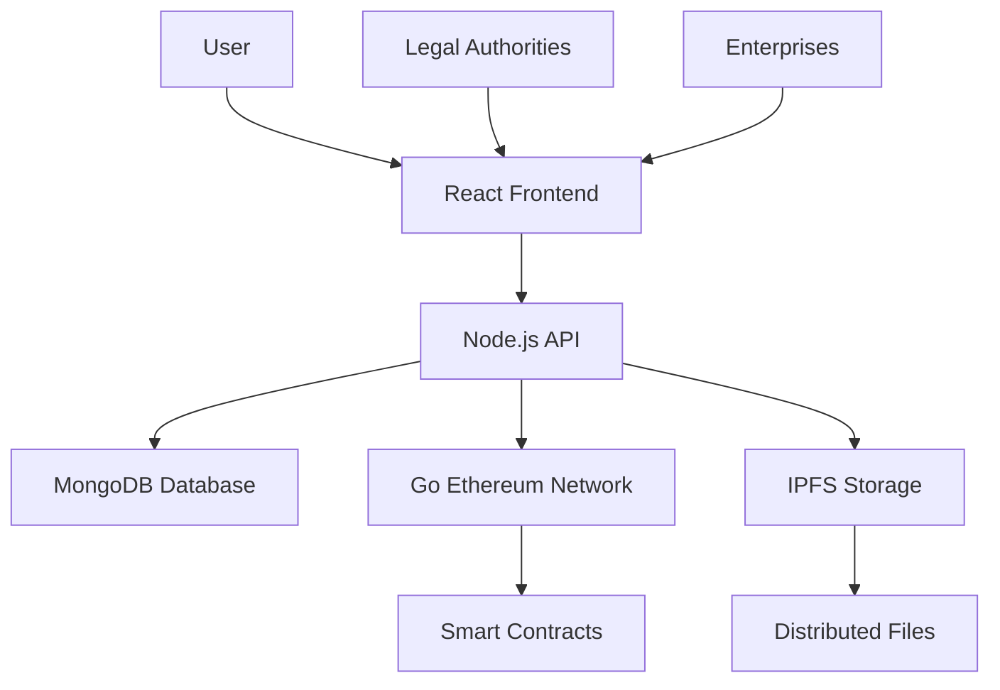

# 🛡️ IPGuardian

<div align="center">


### 🔐 Decentralized Intellectual Property Protection Platform

**Secure • Transparent • Blockchain-Powered**

[](https://choosealicense.com/licenses/mit/)
[](https://nodejs.org/)
[](https://reactjs.org/)
[](https://geth.ethereum.org/)

[🚀 Live Demo](#) • [📚 Documentation](#-features) • [🔧 Installation](#-installation) • [🤝 Contributing](#-contributing)

</div>

---

## 🌟 Project Overview

**IPGuardian** is a revolutionary decentralized platform that empowers creators, inventors, businesses, and legal authorities to secure, register, and verify intellectual property rights with unprecedented transparency and security. Built on blockchain technology, it ensures immutable proof of ownership while providing a user-friendly interface for IP management.

### 🎯 **Mission Statement**
*Democratizing intellectual property protection through blockchain technology, making IP registration accessible, transparent, and globally verifiable.*

---

## ✨ Key Features

### 🔒 **Blockchain Security**
- **Immutable Records**: All IP registrations are permanently recorded on blockchain
- **Cryptographic Proof**: Advanced cryptographic signatures ensure authenticity
- **Decentralized Verification**: No single point of failure or control
- **Smart Contract Integration**: Automated processes with transparency

### 📁 **Decentralized Storage**
- **IPFS Integration**: Files stored on InterPlanetary File System
- **Distributed Architecture**: Enhanced availability and censorship resistance
- **Content Addressing**: Unique hashes for each file ensure integrity
- **Version Control**: Track changes and maintain history

### 🎨 **Modern User Experience**
- **Responsive Design**: Beautiful UI that works on all devices
- **Interactive Dashboard**: Real-time stats and portfolio management
- **Advanced Search**: Filter and discover public intellectual properties
- **Multi-language Support**: Accessibility for global users

### 🏢 **Enterprise Features**
- **Bulk Registration**: Register multiple IPs simultaneously
- **Team Management**: Collaborative IP portfolio management
- **Legal Documentation**: Comprehensive legal framework integration
- **API Access**: Programmatic access for enterprise systems

---

## �️ Technology Stack

<div align="center">

| **Layer** | **Technologies** | **Purpose** |
|-----------|------------------|-------------|
| 🎨 **Frontend** | React.js, Tailwind CSS, Framer Motion, Heroicons | Modern, responsive user interface |
| ⚙️ **Backend** | Node.js, Express.js, MongoDB, Mongoose | RESTful API and data management |
| ⛓️ **Blockchain** | Go Ethereum (Geth), Solidity, Hardhat | Decentralized ledger and smart contracts |
| 📦 **Storage** | IPFS, Pinata | Distributed file storage |
| 🔐 **Security** | JWT, bcrypt, Ethereum signatures | Authentication and encryption |
| 🚀 **DevOps** | Docker, Vite, ESLint, GitHub Actions | Development and deployment |

</div>

---

## 🏗️ Project Architecture



### 📂 **Project Structure**

```
IPGuardian/
├── 🎨 frontend/          # React.js application
│   ├── src/
│   │   ├── components/   # Reusable UI components
│   │   ├── pages/        # Application pages
│   │   ├── context/      # React context providers
│   │   └── assets/       # Static assets
├── ⚙️ backend/           # Node.js API server
│   ├── controllers/      # Request handlers
│   ├── models/          # Database schemas
│   ├── routes/          # API routes
│   └── config/          # Configuration files
├── ⛓️ network/           # Blockchain network
│   ├── contracts/       # Smart contracts
│   ├── node1/ & node2/  # Ethereum nodes
│   └── test/           # Contract tests
└── 📚 docs/             # Documentation
```

---

## 🚀 Getting Started

### 📋 Prerequisites

Ensure you have the following installed:

- **Node.js** (v18.0.0 or higher) - [Download](https://nodejs.org/)
- **MongoDB** (v6.0 or higher) - [Install Guide](https://docs.mongodb.com/manual/installation/)
- **Go Ethereum** (v1.13.0 or higher) - [Install Guide](https://geth.ethereum.org/docs/install)
- **Git** - [Download](https://git-scm.com/)

### ⚡ Quick Installation

```bash
# 1️⃣ Clone the repository
git clone https://github.com/ashikulislamm/IPGurdian.git
cd IPGurdian

# 2️⃣ Install frontend dependencies
cd frontend
npm install

# 3️⃣ Install backend dependencies
cd ../backend
npm install

# 4️⃣ Install blockchain dependencies
cd ../network
npm install
```

### 🔧 Environment Setup

#### **Backend Configuration** (`backend/.env`)
```env
# Database
MONGODB_URI=mongodb://localhost:27017/ipguardian
DB_NAME=ipguardian

# JWT Secret
JWT_SECRET=your_super_secure_jwt_secret_key_here

# Server
PORT=5000
NODE_ENV=development

# Blockchain
ETHEREUM_NETWORK_URL=http://localhost:8545
CONTRACT_ADDRESS=your_deployed_contract_address

# IPFS
IPFS_API_URL=https://api.pinata.cloud
PINATA_API_KEY=your_pinata_api_key
PINATA_SECRET_KEY=your_pinata_secret_key
```

#### **Frontend Configuration** (`frontend/.env`)
```env
VITE_API_BASE_URL=http://localhost:5000
VITE_BLOCKCHAIN_NETWORK_ID=1337
VITE_IPFS_GATEWAY=https://gateway.pinata.cloud
```

### 🏃‍♂️ Running the Application

#### **Option 1: Development Mode (Recommended)**

```bash
# Terminal 1: Start MongoDB
mongod

# Terminal 2: Start Ethereum Network
cd network
npm run start:network

# Terminal 3: Deploy Smart Contracts
cd network
npm run deploy

# Terminal 4: Start Backend API
cd backend
npm run dev

# Terminal 5: Start Frontend
cd frontend
npm run dev
```

#### **Option 2: Docker Deployment**

```bash
# Build and start all services
docker-compose up --build

# Access the application
# Frontend: http://localhost:3000
# Backend API: http://localhost:5000
# Blockchain RPC: http://localhost:8545
```

### 🌐 Access Points

- **Frontend Application**: http://localhost:3000
- **Backend API**: http://localhost:5000
- **API Documentation**: http://localhost:5000/api/docs
- **Ethereum RPC**: http://localhost:8545

---

## 📱 Application Features

### 🏠 **Home Page**
- Hero section with platform introduction
- Latest public IP registrations showcase
- Statistics dashboard
- Partner integrations

### 🔐 **Authentication System**
- Secure user registration and login
- JWT-based authentication
- Password encryption with bcrypt
- Session management

### 📊 **Dashboard**
- Personal IP portfolio overview
- Registration statistics
- Quick actions panel
- Recent activity feed

### 🛒 **Marketplace**
- Browse public intellectual properties
- Advanced filtering and search
- Detailed IP information
- Category-based organization

### 📝 **IP Registration**
- Multi-step registration wizard
- File upload with IPFS integration
- Blockchain verification
- Smart contract interaction

### ⚖️ **Legal Framework**
- Comprehensive Terms & Conditions
- Privacy Policy compliance
- Legal documentation templates
- Regulatory compliance tools

---

## 🔒 Security Features

### 🛡️ **Authentication & Authorization**
- JWT token-based authentication
- Password hashing with bcrypt
- Role-based access control
- Session timeout management

### ⛓️ **Blockchain Security**
- Immutable record storage
- Cryptographic signatures
- Smart contract validation
- Multi-node verification

### 📁 **Data Protection**
- IPFS content addressing
- File integrity verification
- Distributed storage redundancy
- Encryption at rest and transit

---

## 🧪 Testing

### **Run Frontend Tests**
```bash
cd frontend
npm test
```

### **Run Backend Tests**
```bash
cd backend
npm test
```

### **Run Smart Contract Tests**
```bash
cd network
npm run test
```

### **Run End-to-End Tests**
```bash
npm run test:e2e
```

---

## 📚 API Documentation

### **Authentication Endpoints**
```
POST /api/auth/register    # User registration
POST /api/auth/login       # User login
POST /api/auth/logout      # User logout
GET  /api/auth/profile     # Get user profile
```

### **IP Management Endpoints**
```
POST /api/ip/register      # Register new IP
GET  /api/ip/user         # Get user's IPs
GET  /api/ip/:id          # Get specific IP details
PUT  /api/ip/:id          # Update IP information
DELETE /api/ip/:id        # Delete IP registration
```

### **Marketplace Endpoints**
```
GET  /api/ip/marketplace   # Get public IPs
GET  /api/ip/search       # Search IPs
GET  /api/ip/categories   # Get IP categories
GET  /api/ip/stats        # Get platform statistics
```

---

## 🤝 Contributing

We welcome contributions from the community! Here's how you can help:

### **Getting Started**
1. Fork the repository
2. Create a feature branch (`git checkout -b feature/AmazingFeature`)
3. Make your changes
4. Run tests (`npm test`)
5. Commit your changes (`git commit -m 'Add some AmazingFeature'`)
6. Push to the branch (`git push origin feature/AmazingFeature`)
7. Open a Pull Request

### **Development Guidelines**
- Follow the existing code style
- Write tests for new features
- Update documentation as needed
- Use semantic commit messages

### **Code of Conduct**
Please read our [Code of Conduct](CODE_OF_CONDUCT.md) before contributing.

---

## 🐛 Troubleshooting

### **Common Issues**

#### **MongoDB Connection Error**
```bash
# Ensure MongoDB is running
sudo systemctl start mongod

# Check MongoDB status
sudo systemctl status mongod
```

#### **Ethereum Network Issues**
```bash
# Reset blockchain data
cd network
rm -rf node1/data node2/data
npm run init:network
```

#### **IPFS Connection Problems**
- Verify Pinata API credentials
- Check internet connectivity
- Ensure IPFS gateway is accessible

### **Getting Help**
- 📧 Email: support@ipguardian.com
- 💬 Discord: [Join our community](https://discord.gg/ipguardian)
- 📱 Twitter: [@IPGuardianApp](https://twitter.com/ipguardianapp)

---

## 📄 License

This project is licensed under the MIT License - see the [LICENSE](LICENSE) file for details.

---

## 🙏 Acknowledgments

- **Ethereum Foundation** for blockchain infrastructure
- **IPFS Protocol** for distributed storage
- **React Team** for the amazing frontend framework
- **MongoDB** for flexible database solutions
- **Our Contributors** for making this project possible

---

## 🗺️ Roadmap

### **Phase 1: Core Platform** ✅
- [x] Basic IP registration
- [x] User authentication
- [x] Blockchain integration
- [x] IPFS storage

### **Phase 2: Enhanced Features** 🚧
- [ ] Advanced search and filtering
- [ ] Legal document templates
- [ ] Multi-language support
- [ ] Mobile applications

### **Phase 3: Enterprise Solutions** 📅
- [ ] API marketplace
- [ ] Enterprise dashboard
- [ ] Legal authority integration
- [ ] Global expansion

---

<div align="center">

### ⭐ Star this repository if you found it helpful!

**Made with ❤️ by the IPGuardian Team**

[🌟 Star](https://github.com/ashikulislamm/IPGurdian/stargazers) • 
[🐛 Report Bug](https://github.com/ashikulislamm/IPGurdian/issues) • 
[✨ Request Feature](https://github.com/ashikulislamm/IPGurdian/issues)

</div>

